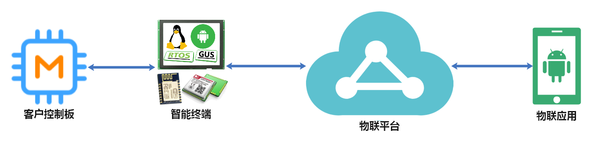

# 关于我们

## **愿**景与使命

> **为5G万物互联时代提供物联型一站式人机交互解决方案**

## **产品与服务**

物联型一站式人机交互解决方案是软硬件为一体的产品方案，为客户提供快速实现产品智能化升级的方案。物联平台作为方案中的软件部分，客户的服务器可以通过对接

#### 智能终端

智能终端作为方案中的硬件部分，包括的产品有IoTgus屏、RTOS智能屏、Linux智能屏、Android智能屏以及网络模块，已集成网络功能，通过简单的配置，客户的控制板对接智能终端产品，无需处理复杂的网络开发问题，即可实现产品快速接入云平台。

#### 物联平台

UartCloud物联平台作为方案中的软件部分，与智能终端深度耦合为一体，方便客户使用。平台以实现了设备管理、设备接入、数据处理以及数据存储功能，客户服务器通过平台的openapi对接，无需处理复杂的设备接入以及协议处理问题，实现快速开发物联应用。

#### 物联应用

以UartCloud物联平台作为基础，客户可以根据自身行业的特性开发自己的物联应用，也可以通过我们帮开发物联应用。

## 联系我们

#### 深圳优云物联科技有限公司

#### 北京优云物联科技有限公司

