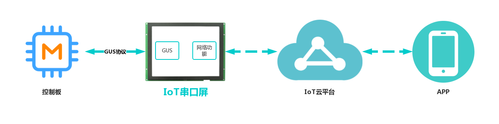

# AGUS应用开发指南

  
IoTGUS是基于GUS的基础上增加网络功能，实现客户的控制系统通过IoT串口屏快速接入物联网平台。‌

根据IoT串口屏的工作流程，IoT串口屏往下对接控制板，往上对接IoT云平台；与控制板通信交互，并且保持串口屏GUS开发方式，并且已使用串口屏的用户基本可以无缝接入。与云端通信交互，已定义好数据模型和网络通信接口，只需要做对网络功能进行配置，基于变量地址的参数配置。‌

IoTGUS采用变量驱动的工作模式，系统定义了一套指令，用户只需要通过调用对进行读、写操作即可实现用户设计的功能或状态。

