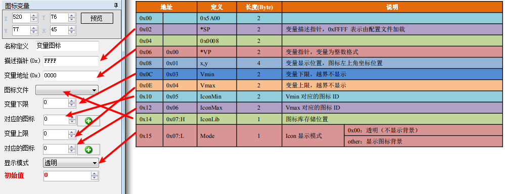
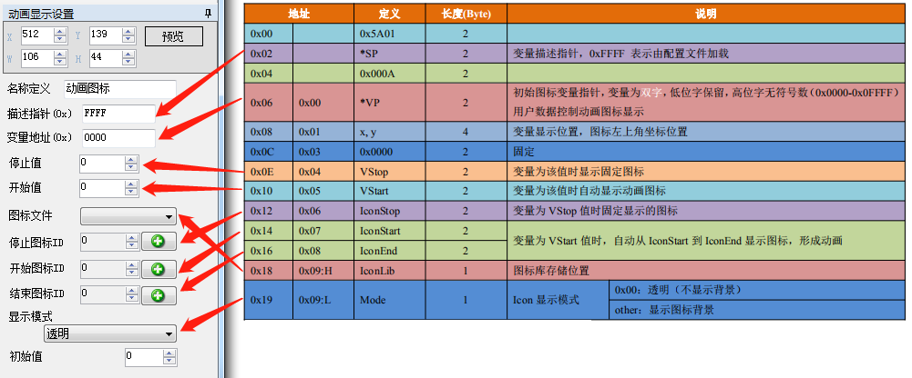
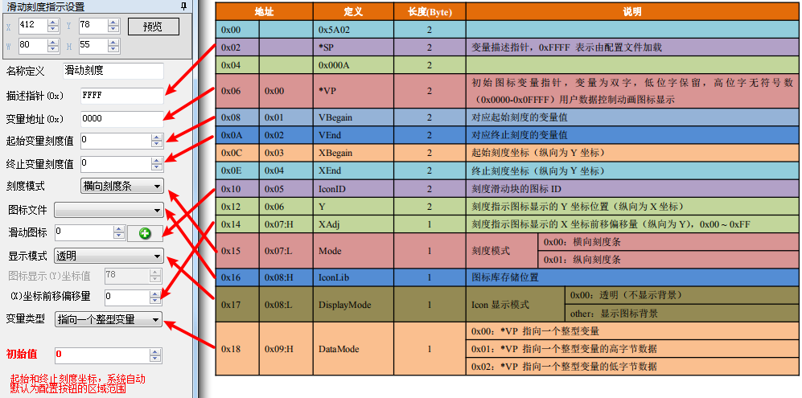
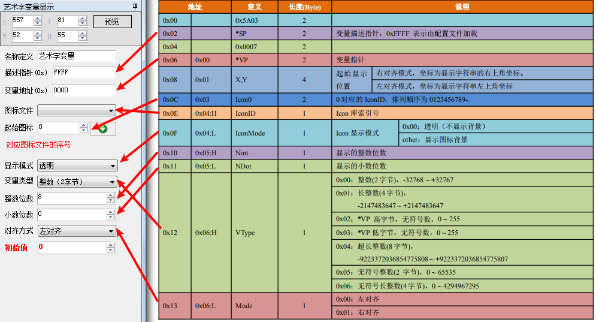
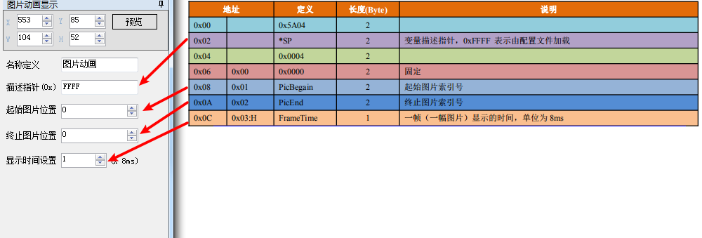
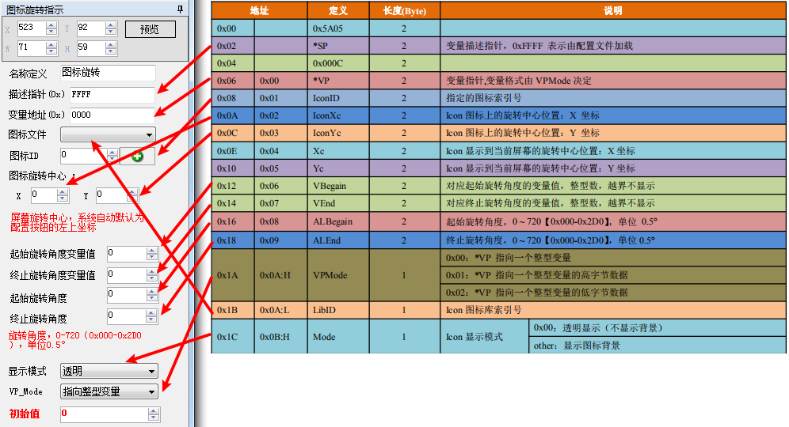
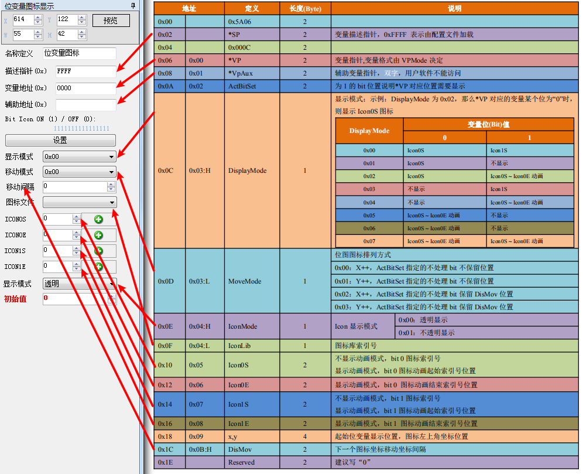
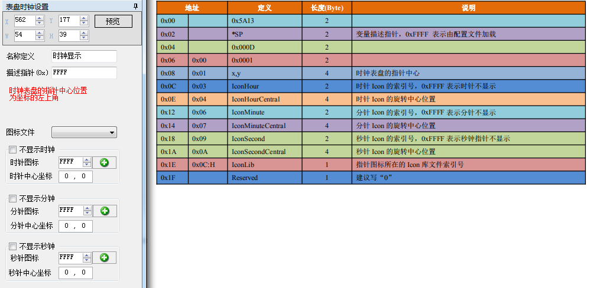

# 图标显示功能

## 变量图标显示【0x00】

## 动画图标显示【0x01】

> Tips： VP +1 为保留位，不可以他用 当变量不等于VStop 或者VStart 时，不显示图标或者动画

## 滑块刻度指示【0x02】

## 艺术字变量显示【0x03】

## 图片动画显示【0x04

> Tips：起始图片索引号必须小于终止图片索引号；如果在终止页面也设置了图片动画变量，可以实现图片循环 显示；在图片动画过程中，可以通过0x80 指令或者触控指令切换页面，从而结束图片动画。

## 图标旋转指示【0x05】

> Tips：本指令主要用于仪表刻度盘的指针指示；旋转时始终假定为“顺时针”转动，即ALEnd 必须大于ALBegain。

## 位变量图标显示【0x06】

## 表盘时钟

