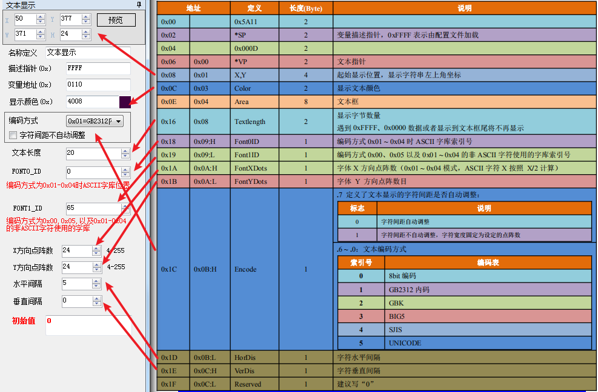
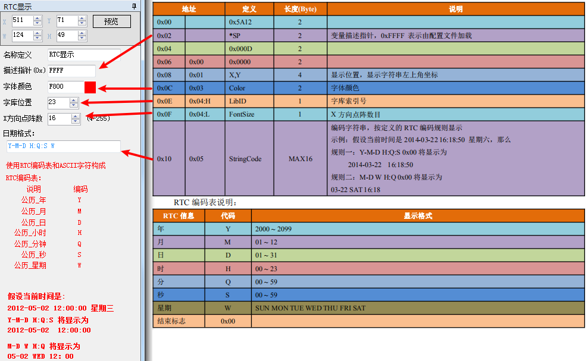
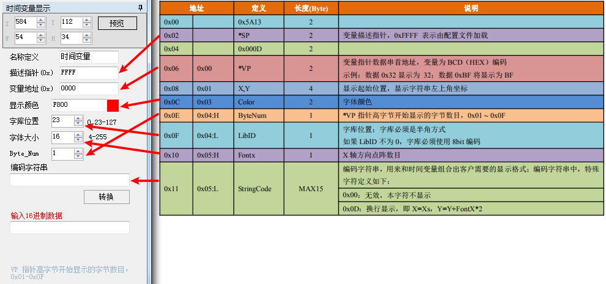
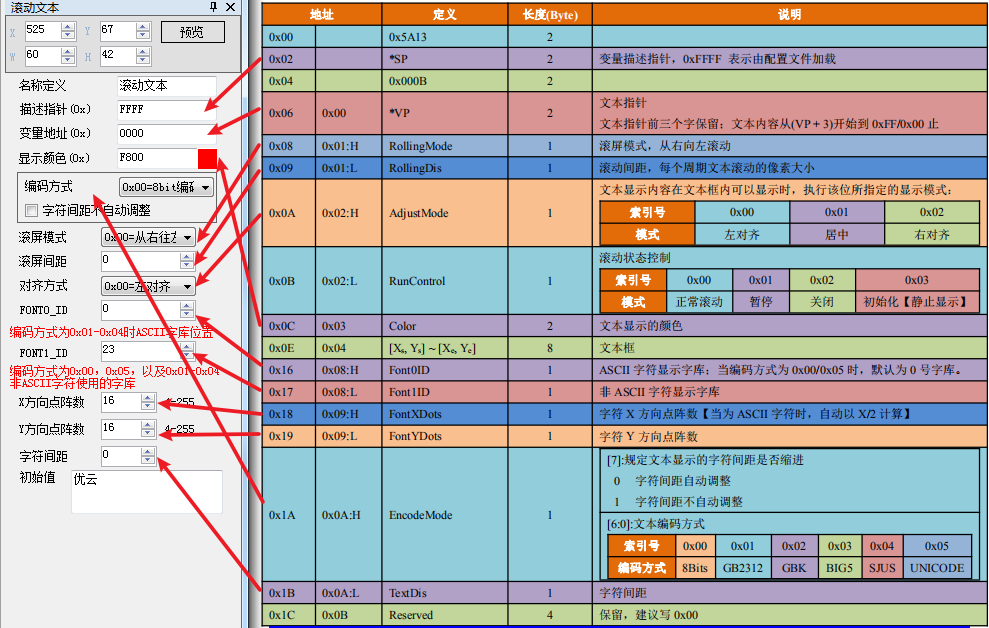

# 文本显示功能

## 数据变量显示【0x10】

数据变量显示控件的描述如下表所示

## 文本显示【0x11】

> Tips：文本显示时，字库中字体的Y 方向点阵数目必须为偶数；显示终端预装的0 号字库，包含4_8 ~ 64x_128 点阵的ASCII 字符。

## 文本RTC 显示【0x12】

## 时间变量显示【0x13】

## 文本滚动显示【0x14】

> Tips：文本显示时，字符的Y 方向点阵数目必须为偶数；IoTGUS 屏预装的0 号字库，包含4x8 ~ 64x128 点阵的字符。

