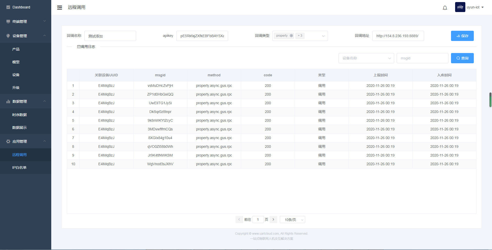

# 应用管理

第三方业务服务器对接，通过远程调用以及回调方式进行数据推送，需要在平台上添加IP白名单以及回调地址。

### 1、远程调用

远程调用包括第三调用以及平台回调，每次的调用与回调，平台都记录日志。使用回调需要客户先配置回调地址。

apikey是客户的回调api需要的key，可以为空。回调类型是客户根据需要，决定那些类型数据是需要通过回调方式推送的。回调地址是客户业务服务器的api

### 2、IP白名单

为了安装保障，第三方服务器对接，首先需要在平台配置IP地址白名单，如果没有配置，将不能接入。

