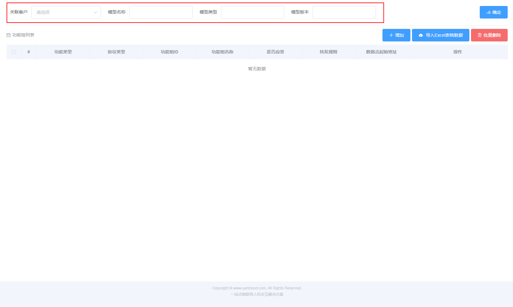
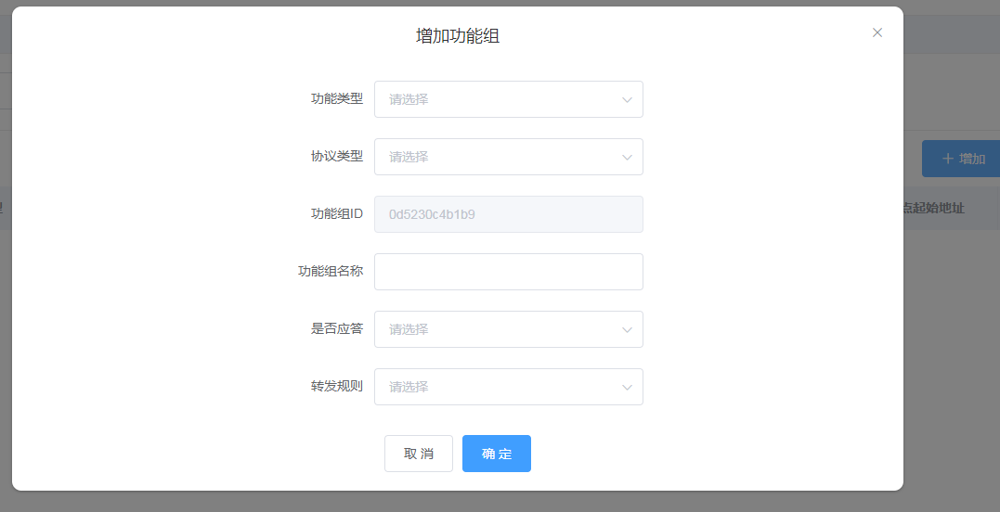

# 创建模型

模型是对一类设备产品功能的抽象，由功能组组成，每个功能组由功能点组成。平台根据客户定义的模型进行数据解析。  
功能组定义：设备的功能是由各个功能模块组成，功能组是对设备的功能模块的抽象，用于设备和平台进行通信的规则以及功能点。  
功能点定义：是具体功能点的描述，包括数据类型和数据长度等等

### 1、创建模型

模型名称：用于描述产品的功能特性，模型是可以给其他类似的产品复用

模型类型：根据应用场景而定

模型版本：模型是产品功能的抽象，随着前期功能比较少，后续慢慢增加功能，所以用于版本进行管理。

### 2、创建功能组

功能类型：根据功能的特性选择，功能类型分为属性、服务、事件，一般的状态数据采集选择属性，类似共享仪器的扫码支付数据使用服务类，而设备故障之类的数据选择事件类。

协议类型：指的是硬件协议，例如modbus等，而智能终端原生支持gus协议格式的数据，同时也支持json格式的数据。后续将支持modbus协议。

功能组id：由系统生成。

功能组名称：可以根据产品功能模块而定

是否应答：指的是设备端上报数据到平台，平台是否需要进行回复收到确认。一般对可靠性要求高的数据会要求平台回复，确保数据收到。

转发规则：数据需要转发到那个服务。post表示平台处理数据后缓存在平台，客户业务系统可以通过平台开发api对数据进行调用；push表示平台处理数据后通过消息服务推送给客户业务系统；rpc表示平台处理数据够通过HTTP回调方式推送数据给客户业务系统。

起始地址：如果选择gus协议，则需要填写起始变量地址，功能组的功能点变量地址是连续的

### 3、创建功能点

创建完成功能组后，对功能组添加功能点，通过功能组的管理功能点进行添加

功能点id：系统生成

功能点名称：具体功能点的名称，例如客厅温度

键名：功能的标识，如temperature

数据类型：根据需要上报的数据而定。

**（2）数据类型说明：**

**number数值类型**：包括int、float等所有数值类型，如果是gus协议是根据数据配置小数位。

**string字符型**：用于传输一段字符串，如果是gus协议，需要选择编码如ASCII、GBK。

**enum枚举型**：用于设定一组集合类的数据，如工作模式：模式一、模式二、模式三。

**bool布尔型**：用于传输非真即假的数据，如开关：0代表关，1代表开。

