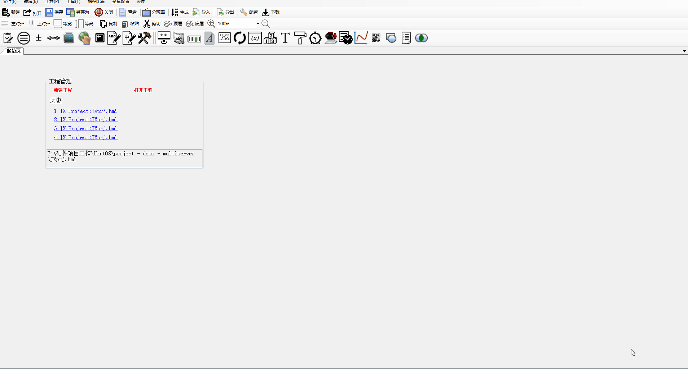
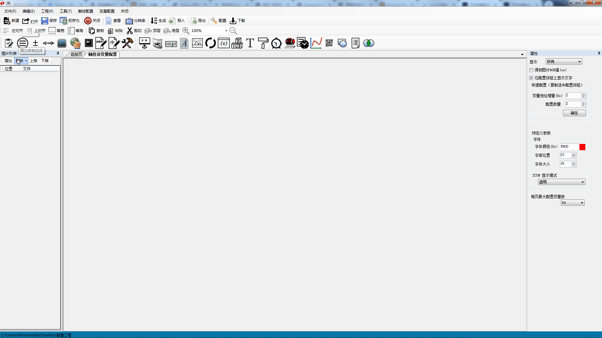
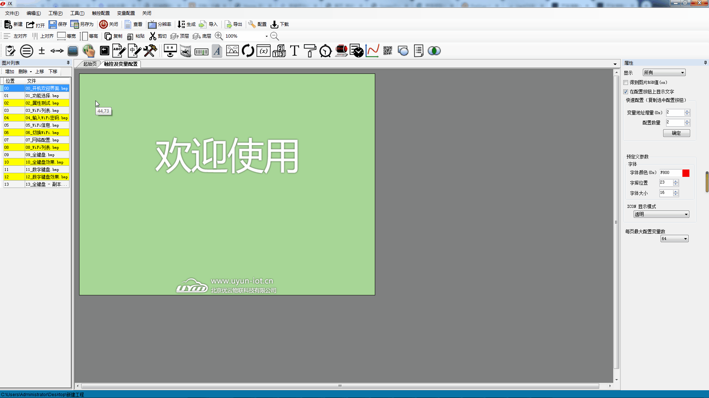
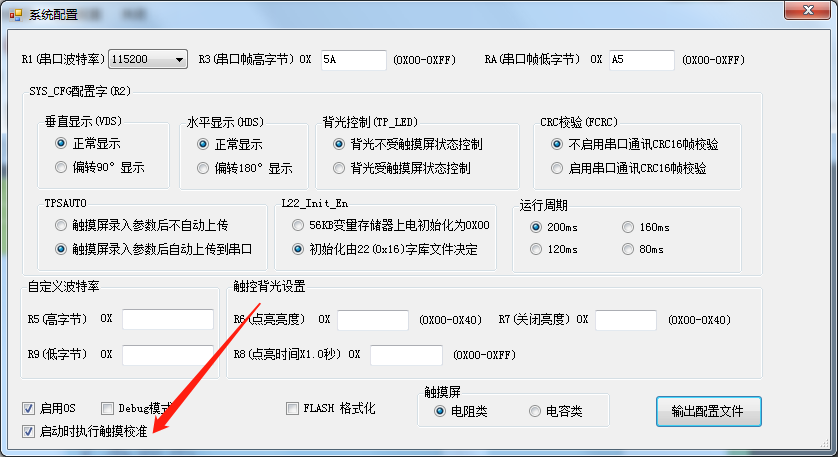

# 开发准备说明

## 搭建开发环境

### 搭建硬件环境

硬件环境的搭建，需要用到PC电脑、USB转串口调试板、IoTgus屏。

PC电脑：推荐使用Windows 7操作系统。  
USB转串口调试板：USB转串口调试板与支持RS-232与TTL电平与IoTgus屏功能通信，同时给屏供电。

### 搭建软件环境

开发过程使用到的软件，主要是串口调试助手和IoTgus屏配置工具

**串口调试工具：**用于调试模拟上位机与IoTgus屏通信，推荐使用sscom5.13.1；



  
**IoTgus配置工具：**用具开发配置IoTgus屏的功能，配置系统参数（config.TXT文件）、14变量配置文件、13触控配置文件、22初始化文件。这是用于完成IoTgus屏最最主要的功能，也是最基本的工作。



### IoTgus配置工具介绍

下载IoTgus配置工具，如下所示：

#### 启动工具

工具运行依赖 **.net3.5** 以上。双击上图中的“**JX.exe**"文件，启动配置工具如下所示：

#### 新建工程

新建工程需要特别注意选择与IoTgus屏一直的分辨率，操作如下演示如下

新建完成后，会产生如下图所示的目录和文件：

* **DD\_SET**：所有需要下载到IoTgus屏的文件，到存放次目录
* **ICON**：存放icon文件
* **image**：存放图片，建议把可能需要用到的图片放到此目录，便于管理
* TFT：无
* **JXprj.hmi**：功能主文件，配置工具通过次次文件打开工程
* **JXprj.tft**：无

#### 添加图片素材

新建工程后，把准备好的图片导入到工程项目中，图片素材作为背景图，格式严格要求bmp、24bit色，分辨率与IoTgus屏一直，操作如下所示

#### 系统配置

根据系统配置说明，进行如下图所示的配置，波特率115200、帧头5AA5、R2配置为08、选择电容屏、开机启动校准，然后并输出配置文件（config.txt）

#### 保存工程

配置基本配置完成后，保存工程，并点击生成。

经过以上的几个步骤，工程已经建立完成，打开工程目录下的文件夹DD\_SET，根据需要添加字库文件、图标库文件等。

#### 导入工程

配置工具还可以导入现有的工程，操作步骤：

1. 创建新的工程项目
2. 通过配置工具导入原有工程的图片
3. 把原有工程的图标、字库复制到新工程的DD\_SET文件夹
4. 通过配置工具导入原工程的13、14配置文件

## IoTgus屏上电调试

### 文件下载

通过配置工具完成工程的创建后，可以通过SD卡下载到IoTgus屏，SD卡应格式化为FAT32 文件系统。

**操作步骤**

1. 把工程中的DD\_SET文件夹复制到SD卡的根目录中；
2. 把需要下载到终端的图片、字库、配置文件都放在DD\_SET文件夹中；
3. 将终端断电，插入SD卡；
4. 重新给终端上电，IoTgus屏将自动加载DD\_SET 文件夹中的内容，并保存到终端设备；
5. 等到蜂鸣器鸣叫一声之后，更新完成，用户可以拔出SD卡，重新上电之后进入正常工作模式。

### 触摸屏校准

#### **方法一：** 

在创建工程在配置是，勾选了“启动时执行触摸校准”功能在CONFIG.TXT 文件中写入“TP\_CORRECT”命令，IoTgus屏将在下载完成文件后，将进入一次触摸屏校准过程。IoTgus屏会自动检验校准是否有效，如果无效校准，IoTgus屏不会被错误的设置。

#### **方法二：**

在IoTgus屏正常工作情况下，如果3秒内连续点击非触控区域超过20次，则进入触摸屏校准模式，步骤如下：

1. 3秒内，连续点击非触控区域超过20次；
2. 进入校准模式，按照十字交叉线的提示点击触摸屏的指定位置校准；
3. 校准结束，返回进入校准前的画面。

#### **方法三：**

在IoTgus屏正常工作情况下，通过串口向0xEA 寄存器写入0x5A，启动一次触摸屏校准过程。IoTgus屏会自动检测校准是否有效；当校准无效时，IoTgus屏会一直执行校准操作，直至校准检测有效。如 果多次校准均为无效时，那么触摸屏可能存在物理损伤，譬如排线断裂、触摸板损伤……

## 指令测试

工程下载并校准之后，此时可以通过指令测试是否能够正常通信，例如读取版本号指令

> 控制系统发送：5A A5 03 81 00 01  
> IoTgus屏回复：5A A5 04 81 00 01 64

更多指令测试可以参考《[寄存器功能描述](https://docs.uyun-iot.cn/iot/terminal/iotgus/regvar/register)》

