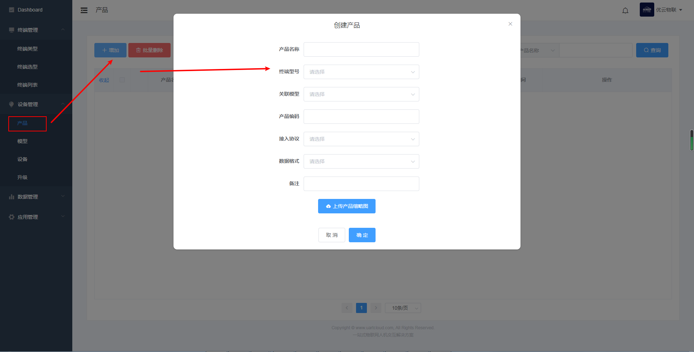

# 创建产品

客户登录串口云控制台后，可在添加新产品页面快速注册产品。平台会为每个产品生成唯一的产品UUID和产品授权码。在终端注册激活需要写入产品授权码，即可实现设备和云端的实时数据通信，方便批量生产。

**产品名称**：基于智能终端开发的新产品名称。

**终端型号**：该产品使用的终端型号，例如8寸IoT串口屏。

**关联模型**：模型代表产品的功能，还没有模型，则需要创建模型。如果终端型号是成品，则出厂前已经关联模型。

**产品编码**：客户可以为每个产品进行编码，方便管理。

**接入方式**：根据终端型号的支持的协议而定。

**数据格式**：根据终端型号选择。标准数据格式为ujson，有的终端型号也支持私有数据格式。

**备注**：根据需要而定

