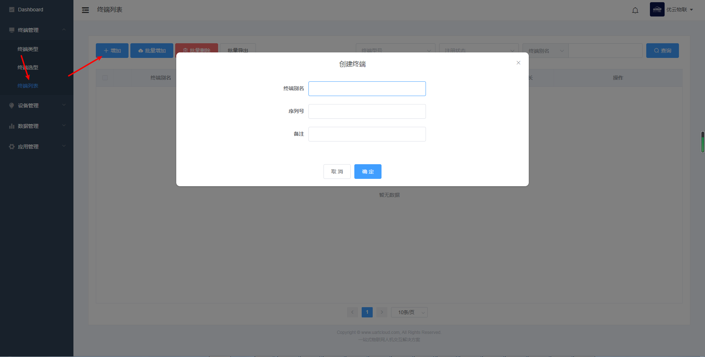

# 添加智能终端

智能终端是对本公司所生产研发的智能屏以及智能模块的统称。对于已经购买智能终端的用户，可以登录云平台的控制台，找到终端管理的终端列表添加终端，输入终端序列号即可添加到自己的账户下；也可以通过串口云助手APP进行扫码添加终端。

终端别名：根据场景为终端起个别名，这也将是客户的设备名称。默认是终端名称，例如8寸串口屏。  
序列号：智能终端在出厂时，分配有唯一序列号。  
备注：根据需要而定

