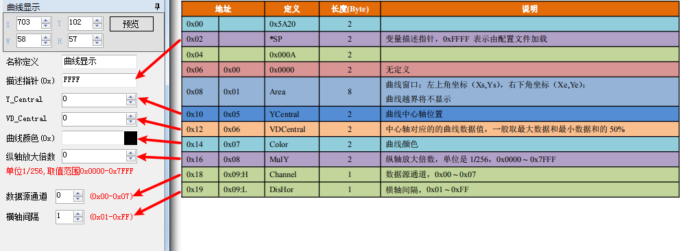
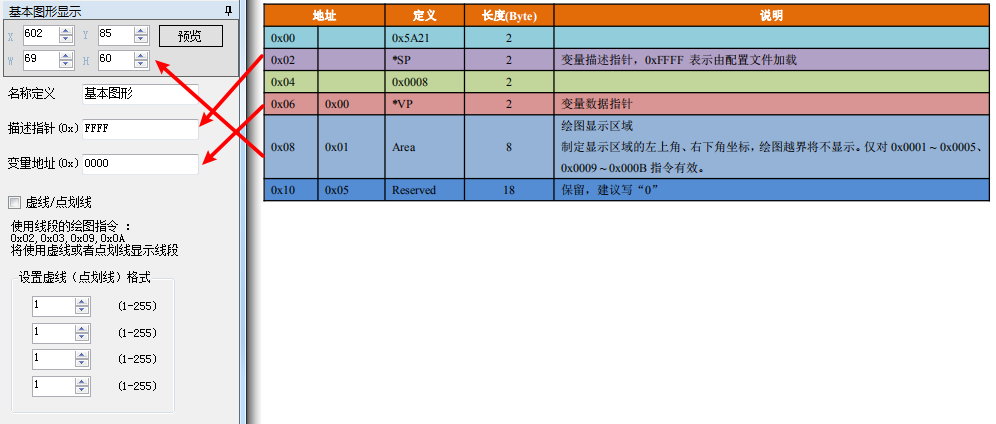
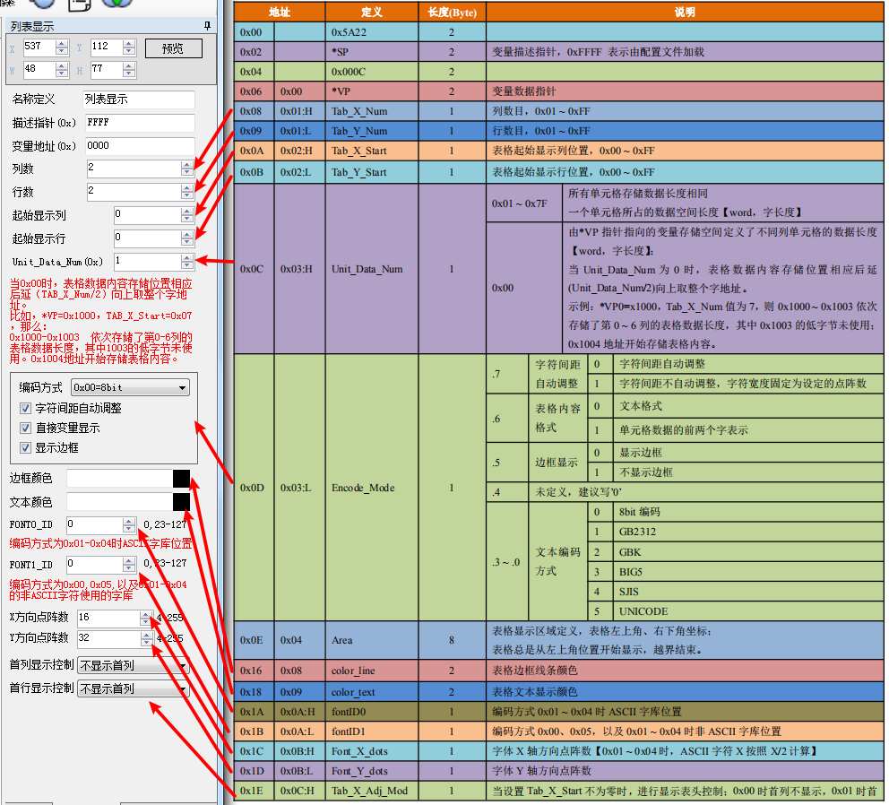

# 图形显示功能

### 3.1、曲线显示【0x20】

### 3.2、基本图形显示【0x21】

基本图形显示先在14.bin 中定义一个“绘图板”功能，而具体的绘图操作则由\*VP 指向的变量空间内的内容决 定。用户通过发送不同的数据帧来实现不同的绘图功能。

变量空间内的变量数据帧结构说明：

绘图指令帧数据包格式能说明

> 判断条件：0xFF 为绘图操作结束；0xFE 为忽略本次操作。

### 3.3、列表显示【0x22】

当Encode\_Mode 的第6 位为”1”时，每个单元格数据内容的前两个字定义了表格数据格式，具体定义如下：

如果表格实际内容短于Unit\_Data\_Num 规定的长度时，使用0xFFFF 做为单元格文本结束符。对于特别大的表 格，通过触摸屏操作来修改TAB\_X\_Start、TAB\_Y\_Start 值可以很方便的实现表格的定位或拖动。

### 3.4、二维码显示【0x25】

