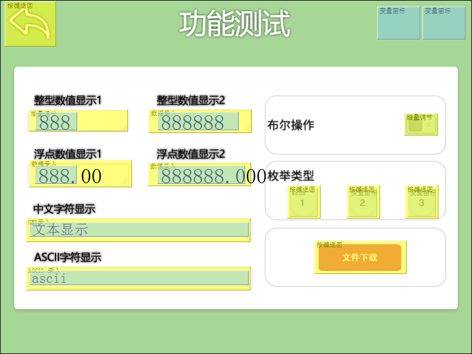
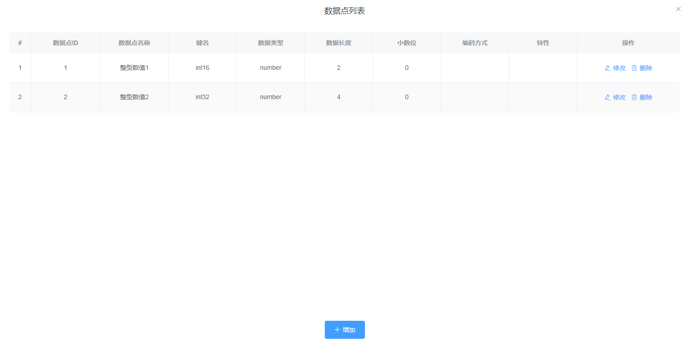

# 整体方案开发指引

物联网整体方案涉及环节众多，基于本公司的物联型人机交互解决方案，可以轻松实现物联网方案。以下是通过整体方案指引，各个环节的配置说明，智能终端以IoT串口屏为例。

基本思路是先配置IoT串口屏功能，根据IoT串口屏功能在平台上配置模型，然后接入调试，完成后开发mcu以及应用服务器

## 1、配置IoT串口屏

### 1.1 配置功能点

#### 整型数值显示组

| **功能点名** | **变量地址** | **类型** | **长度** |
| :--- | :--- | :--- | :--- |
| 整型数值显示1 | 0100 | 整数 | 2字节 |
| 整型数值显示2 | 0101 | 长整数 | 4字节 |

#### 浮点数值显示组

| **功能点名** | **变量地址** | **类型** | **长度** | 小数位 |
| :--- | :--- | :--- | :--- | :--- |
| 整型数值显示1 | 0103 | 整数 | 2字节 | 2 |
| 整型数值显示2 | 0104 | 长整数 | 4字节 | 3 |

#### 布尔操作组

| **功能点名** | 变量地址 | 类型 | 长度 |
| :--- | :--- | :--- | :--- |
| 开关 | 0106 | 整数 | 2字节 |

**枚举类型组**

<table>
  <thead>
    <tr>
      <th style="text-align:left"><b>&#x529F;&#x80FD;&#x70B9;</b>
      </th>
      <th style="text-align:left"><b>&#x53D8;&#x91CF;&#x5730;&#x5740;</b>
      </th>
      <th style="text-align:left"><b>&#x7C7B;&#x578B;</b>
      </th>
      <th style="text-align:left"><b>&#x957F;&#x5EA6;</b>
      </th>
      <th style="text-align:left">&#x503C;</th>
    </tr>
  </thead>
  <tbody>
    <tr>
      <td style="text-align:left">&#x6A21;&#x5F0F;&#x9009;&#x62E9;</td>
      <td style="text-align:left">0107</td>
      <td style="text-align:left">&#x6574;&#x6570;</td>
      <td style="text-align:left">2&#x5B57;&#x8282;</td>
      <td style="text-align:left">
        
1&#xFF1A;&#x6A21;&#x5F0F;1

        
2&#xFF1A;&#x6A21;&#x5F0F;2

        
3&#xFF1A;&#x6A21;&#x5F0F;3

      </td>
    </tr>
  </tbody>
</table>

#### 字符显示组

| 功能点 | 变量地址 | 编码方式 | 长度 |
| :--- | :--- | :--- | :--- |
| 中文显示 | 0110 | GB2312 | 20字节 |
| 英文显示 | 011A | ASCII | 20字节 |

### 1.2 配置网络功能

根据网络配置说明，进行配置即可。主要是配置网络状态、WiFi配置、终端信息的功能。通过终端信息功能获取终端序列号

### 1.3 完成的示例工程参考

以下是示例工程



## 2、平台配置

### 2.1 添加终端

根据通过终端信息获取的终端序列号在平台上添加终端。

### 2.2 创建模型

#### 整型数值功能组

#### 浮点数值功能组

依次类推，把其他的功能点配置完成

### 2.3 创建产品

如果已有产品，可以不用创建，找到产品授权码product\_auth。

